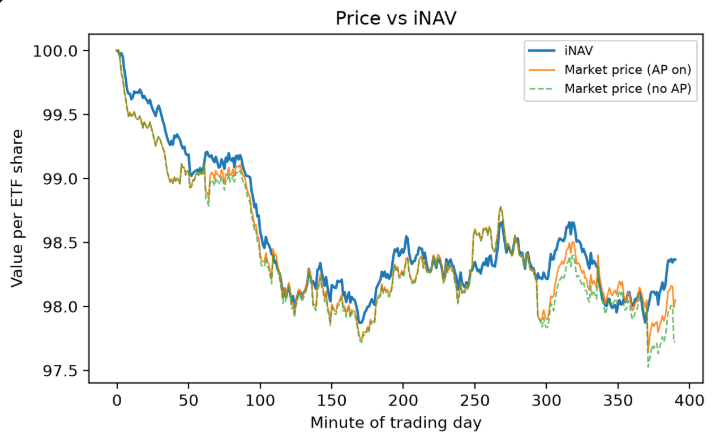
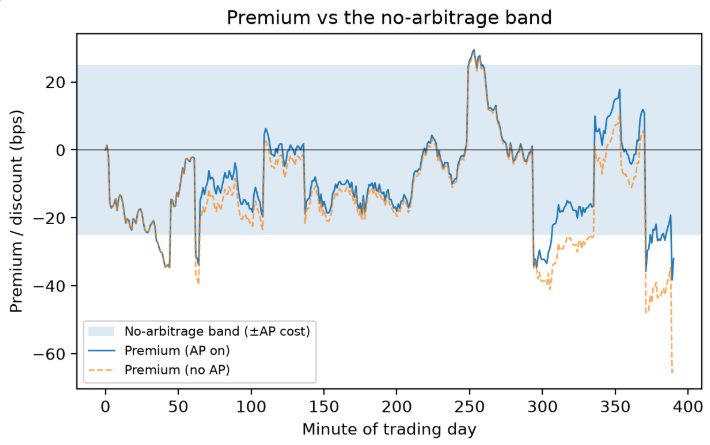

# ETF creation/redemption and premium/discount simulator

> Live app: https://etf-arb-simulator.streamlit.app

A Streamlit app I built to make one piece of market plumbing visible: the
Authorised Participant (AP) arbitrage that keeps an ETF's share price close to
the value of what the fund actually holds.

## Why I built it

An ETF has two prices that don't have to agree. There's the value of the basket
it owns, published as NAV at the end of the day and estimated minute by minute
as iNAV. And there's whatever people pay for the fund on the exchange, which is
just supply and demand. No rule of the exchange forces those numbers to match.

What keeps them together is the creation/redemption process, which most
explainers cover in a sentence and then move on. When the premium or discount
gets wide enough to cover an AP's cost of trading, the AP steps in. On a
premium it buys the underlying shares, delivers them to the fund in-kind, gets
a block of new ETF shares back and sells them. On a discount it runs the trade
in reverse. Either way the supply of ETF shares changes, and that pushes the
price back toward NAV. The practical result is that the gap lives inside a band
about as wide as the AP's all-in cost.

I could write that paragraph and hope it landed. I'd rather let someone widen
the band with a slider and watch what happens.

## What the app does

### Simulator

A synthetic five-stock ETF over one trading day, in minute
steps. A correlated GBM basket drives the iNAV. Demand shocks and order-flow
noise push the market price away from it. An AP module creates or redeems whole
creation units whenever the premium clears its cost. Sliders control basket
volatility, shock size and frequency, creation-unit size, AP cost (which is the
band width), AP aggressiveness as a stand-in for competition, and price impact
per unit. One checkbox re-runs the identical shock path with the AP switched
off, so the counterfactual isn't a different random world, it's the same day
without the plumbing.

### Real UCITS ETF data

Pulls Irish-domiciled S&P 500 UCITS ETFs (CSPX.L,
VUAA.L, SPY5.L) and the S&P 500 total-return index through yfinance, then plots
growth of 100, rolling one-year tracking difference, and annualised tracking
difference and tracking error. Yahoo only carries market prices, so a true
premium/discount isn't available from it. Rather than fake one from prices, the
tab takes an issuer NAV history CSV (columns `date` and `nav`) and computes the
premium properly against official NAVs.

### Explainer

Notes on creation units, in-kind versus cash creation, iNAV, what
the AP is actually doing, why so many UCITS ETFs are domiciled in Ireland (15%
rather than 30% US dividend withholding under the treaty), and why tracking
difference and tracking error are not the same thing.

## Screenshots

| Simulator | Premium against the band |
| --- | --- |
|  |  |

## Running it locally

```bash
git clone https://github.com/sasmitha-jayakody/etf-arb-simulator.git
cd etf-arb-simulator
python -m venv .venv
source .venv/bin/activate          # Windows: .venv\Scripts\activate
pip install -r requirements.txt
streamlit run streamlit_app.py
```

The tests check economic invariants rather than just that nothing crashes:

```bash
pip install -r requirements-dev.txt
PYTHONPATH=src python -m pytest tests/ -v
```

## Layout

```
streamlit_app.py        UI only, no model logic
src/etf_sim/
  config.py             SimParams dataclass, one field per slider
  basket.py             correlated GBM basket, holdings per share, iNAV
  ap.py                 the AP decision rule: band, intensity, whole-unit floor
  engine.py             one simulated trading day into a tidy DataFrame
  realdata.py           yfinance fetch, TD/TE metrics, NAV-based premium
content/explainer.md    rendered by the Explainer tab
tests/test_engine.py    NAV invariance, band respected, AP tames the premium
```

Keeping the model in `src/etf_sim/` was mostly so I could test it. Nothing in
there imports Streamlit, so the whole thing runs under pytest without a browser.

## Modelling choices, and where they break

I model the premium directly (`price = iNAV × (1 + premium)`) rather than
simulating an order book. Three things move it: occasional lumpy demand shocks,
per-minute order-flow noise, and mild natural mean reversion, because plenty of
non-AP traders also lean against an obvious gap. Doing it this way separates the
price/NAV gap from basket volatility, which is the thing I wanted on screen.

AP intensity scales with how far the gap sits beyond cost, then gets floored to
whole creation units and capped per step. Small mispricings survive, which is
what you see in real funds, and big ones close fast.

In-kind pro-rata creations leave NAV per share unchanged by construction, and
there's a test asserting that. If it ever fails I've broken the basket
accounting.

What I left out on purpose: bid/ask spread, multiple competing APs with
different costs, order cut-off times, settlement lag, and any non-linearity in
price impact. Impact in particular is the weakest assumption here. In reality it
scales sub-linearly and depends on how liquid the basket is that morning, so the
simulator is too kind to very large creations. The aggressiveness slider is a
crude proxy for competition rather than a model of it.

## Disclaimers

This is a learning project. None of it is investment advice, and the simulator
is not calibrated to any real fund. yfinance data is unofficial and delayed.
Official NAVs come from the issuer, not from here.

## License

MIT.
